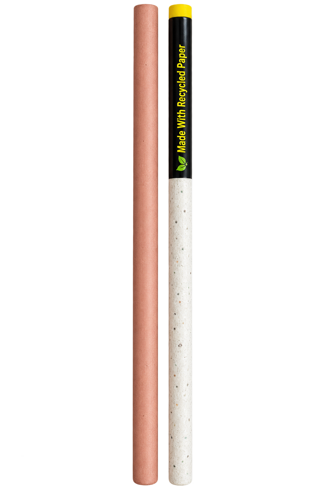

# LETS — Recycled-Paper Pencil

### Product Management Case Study

> **Building an affordable, sustainable alternative to conventional wooden pencils through recycled-paper manufacturing, product innovation, and scalable distribution.**

## 🚀 Executive Summary

**LETS** is a recycled-paper pencil product concept designed to deliver the familiar functionality of a conventional pencil while replacing the traditional wooden body with recycled paper.

The project explores the complete product lifecycle:

**Problem → Product → Prototype → Economics → GTM → Metrics → Roadmap**

The long-term vision is to make sustainable stationery accessible to a mass-market audience without requiring customers to change their everyday pencil usage.

---

## 🎯 Product Challenge

The core challenge is:

> **How might we create a recycled-paper pencil that delivers conventional-pencil functionality while remaining affordable, scalable and commercially viable?**

LETS focuses on balancing:

| Product Dimension | Objective                                 |
| ----------------- | ----------------------------------------- |
| ♻️ Sustainability | Recycled-paper body                       |
| ✏️ Quality        | Conventional-pencil writing experience    |
| 💰 Affordability  | Cost-effective production                 |
| 🏭 Scalability    | Standardized and mechanized manufacturing |
| 🎨 Customization  | Institutional and bulk applications       |

---

## 💡 Product Vision

> **Make sustainable pencils as accessible and affordable as conventional pencils without compromising everyday writing quality.**

---

## 🔬 Prototype Validation

A working LETS prototype was developed and tested.

*LETS recycled-paper pencil prototype.*

---

| Test                | Result                            |
| ------------------- | --------------------------------- |
| Writing performance | Comparable to conventional pencil |
| Standard sharpening | Works with regular sharpener      |
| Recycled-paper body | Implemented                       |
| LETS branding       | Implemented                       |

### Key Product Learning

> **Change the material, not the everyday experience.**

The prototype demonstrates that a sustainable pencil can retain familiar customer behavior while changing the underlying pencil-body material.

---

## 🧩 MVP Strategy

### Must Have

* Recycled-paper body
* Functional graphite core
* Writing performance
* Durability
* Standard-sharpener compatibility
* Affordable production

### Should Have

* LETS branding
* Attractive design
* Sustainable packaging
* Institutional customization

### Could Have

* Personalized designs
* Multiple pencil variants
* Customized packaging
* Expanded sustainable stationery products

---

## 💰 Unit Economics

Current prototype-level economics:

| Metric                          |              Value |
| ------------------------------- | -----------------: |
| Production cost                 | **₹1.50 / pencil** |
| LETS → Wholesaler               | **₹3.00 / pencil** |
| Wholesaler → Retailer           | **₹3.80 / pencil** |
| Gross profit at wholesale price | **₹1.50 / pencil** |
| Gross margin                    |           **50%*** |

*Based on the current prototype production cost and proposed wholesale price, before additional commercial expenses such as packaging, logistics, wastage and machinery.

### Core Business Challenge

> **Reduce production cost without compromising product quality.**

---

## 🚚 Go-to-Market

### Initial Distribution

**LETS → Wholesaler → Retailer → Customer**

### Market Entry

**Educational Market**

* School students
* College students
* Schools
* Educational institutions

### Growth

**Pilot → Retail Distribution → Institutional Sales → Customization → Mass-Market Expansion**

Potential institutional applications include:

* School-branded pencils
* College/event pencils
* Bulk customized orders
* Sustainability initiatives

---

## 📊 Success Metrics

### Product

* Writing performance
* Sharpening compatibility
* Durability

### Operations

* Production cost
* Production time
* Material wastage
* Defect rate

### Commercial

* Gross margin
* Wholesale adoption
* Retailer adoption
* Units sold

### Growth

* Repeat purchases
* Institutional orders
* Customization orders
* Distribution expansion

---

## 🗺️ Product Roadmap

**Prototype Validation**

↓

**Product Optimization**

↓

**Manufacturing Standardization**

↓

**Mechanization**

↓

**Market Pilot**

↓

**Institutional Growth**

↓

**Mass-Market Expansion**

### Roadmap Principle

> **First prove the product. Then prove the process. Then prove the market. Then scale.**

---

# 📚 Detailed Case Study

| Section                                                                    | What it covers                            |
| -------------------------------------------------------------------------- | ----------------------------------------- |
| [Problem Statement](02_Problem_Statement/problem-statement.md)             | Problem, opportunity and target customers |
| [Market & Competitive Analysis](03_Market_Research/competitor-analysis.md) | Market context and positioning            |
| [MVP & Product Strategy](04_Product_Strategy/mvp-and-prioritization.md)    | MVP and feature prioritization            |
| [Prototype Testing](05_Prototype/prototype-testing.md)                     | Prototype validation and product risks    |
| [Unit Economics](06_Unit_Economics/pricing-model.md)                       | Cost, pricing and margins                 |
| [Go-to-Market](07_GTM/go-to-market.md)                                     | Distribution and launch strategy          |
| [KPIs](08_Metrics/kpis.md)                                                 | Product and business metrics              |
| [Product Roadmap](09_Roadmap/product-roadmap.md)                           | Product evolution and scaling             |

---

## 🧠 Product Management Skills Demonstrated

This project demonstrates practical work across:

* Product problem definition
* Product vision
* Customer segmentation
* MVP definition
* Feature prioritization
* Prototype validation
* Competitive analysis
* Product positioning
* Unit economics
* Pricing strategy
* Go-to-market planning
* KPI definition
* Product roadmap
* Manufacturing scalability

---

## 🔮 Future Opportunities

Potential future directions include:

* Automated/semi-automated manufacturing
* Institutional customization
* Expanded sustainable stationery
* E-commerce distribution
* Multiple pencil variants
* Sustainable packaging
* Large-scale retail distribution

---

## ⚠️ Current Limitations

The current project is at the prototype/product-development stage.

The following require further validation before commercial-scale launch:

* Large-scale manufacturing cost
* Long-term durability
* Production consistency
* Customer willingness to switch
* Retailer adoption
* Institutional demand
* Final consumer pricing

These are identified as **future validation areas rather than assumed results**.

---

## 📌 Project Focus

**LETS — Recycled-Paper Pencil**

**Product Development • Product Strategy • Unit Economics • Go-to-Market • Sustainability**

> *From a recycled-paper prototype to a scalable sustainable stationery product.*
